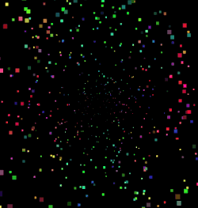

# screensaver

Desktop application developed using [Open Source Qt Framework](https://www.qt.io) and [OpenGL](https://www.opengl.org/) as the second of three assignments for the Computer Graphics subject at Federal University of ABC, given by professor [João Paulo Gois](http://professor.ufabc.edu.br/~joao.gois/) in the third quarter of 2019.

- [tic-tac-toe](https://github.com/gmurayama/tic-tac-toe)
- screensaver

## Preview

## Built with

- C++ 11
- Qt 5.12.5
- OpenGL 4.5
- Qt Creator 4.10.1 Community
